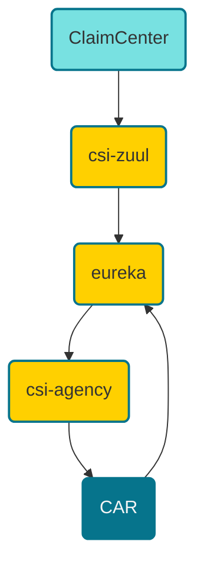

# pg-test-repo

```mermaid
graph TD
    idClaimCenter(ClaimCenter) -->
    idZuul(csi-zuul) -->
    idEureka(eureka) -->
    idAgency(csi-agency) -->
    idCar(CAR) --> idEureka

class idClaimCenter teal;
class idCar darkteal;
class idCia teal;

classDef default fill:#ffd000, stroke:#06748c, stroke-width:2px;
classDef blue fill:#1a1446, stroke:#06748c, stroke-width:2px;
classDef teal fill:#78e1e1, stroke:#06748c, stroke-width:2px;
classDef darkteal fill:#06748c, stroke:#06748c, stroke-width:2px, color:#f5f5f5;
classDef gray fill:#f5f5f5, stroke:#06748c, stroke-width:2px;
```
