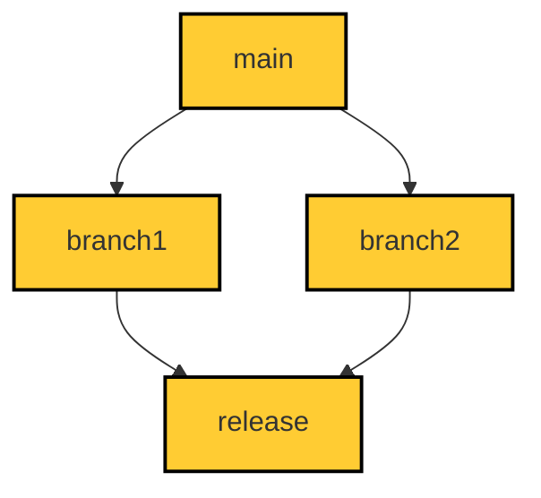
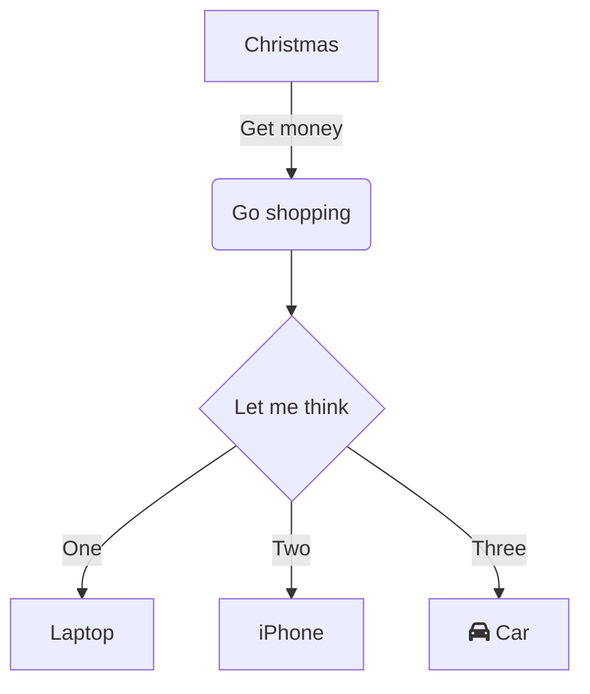

# pg-test-repo

```mermaid
graph TD
main-->branch1
main-->branch2
branch1-->release
branch2-->release
classDef default fill:#ffcc33,stroke:#000000,stroke-width:2px
```

```mermaid
graph TD
    A[Christmas] -->|Get money| B(Go shopping)
    B --> C{Let me think}
    C -->|One| D[Laptop]
    C -->|Two| E[iPhone]
    C -->|Three| F[fa:fa-car Car]
    
```
