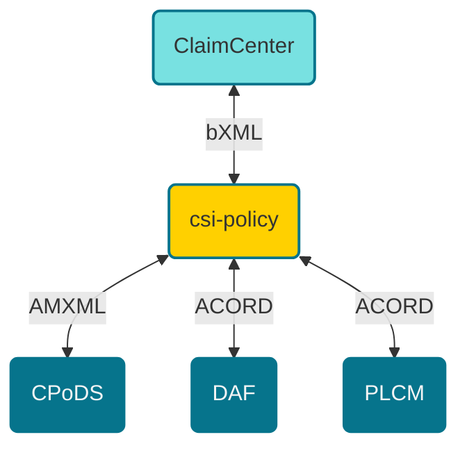
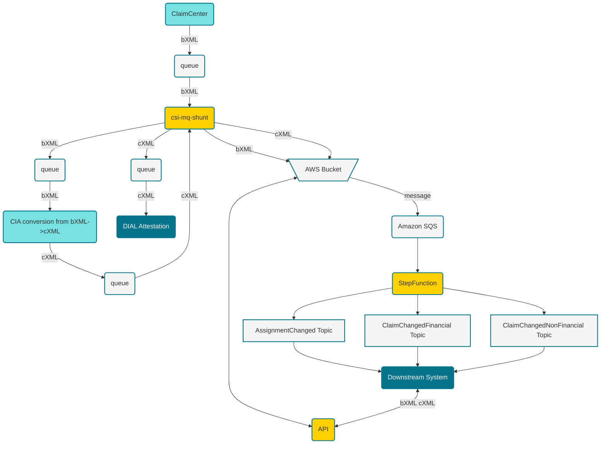

# pg-test-repo

## csi-policy

```mermaid
flowchart TD
    idClaimCenter(ClaimCenter) <--> | bXML | idPolicy(csi-policy)
    idPolicy(csi-policy) <--> | AMXML | idCpods(CPoDS)
    idPolicy(csi-policy) <--> | ACORD | idDaf(DAF)
    idPolicy(csi-policy) <--> | ACORD | idPlcm(PLCM)

class idClaimCenter teal;
class idCia teal;
class idCpods darkteal;
class idDaf darkteal;
class idPlcm darkteal;

classDef default fill:#ffd000, stroke:#06748c, stroke-width:2px;
classDef blue fill:#1a1446, stroke:#06748c, stroke-width:2px;
classDef teal fill:#78e1e1, stroke:#06748c, stroke-width:2px;
classDef darkteal fill:#06748c, stroke:#06748c, stroke-width:2px, color:#f5f5f5;
classDef gray fill:#f5f5f5, stroke:#06748c, stroke-width:2px;
```

##  claim event

```mermaid
flowchart TD
    idClaimCenter(ClaimCenter) --> |bXML| idQueue1(queue):::gray
    idQueue1 --> |bXML| idMqShunt(csi-mq-shunt)
    idMqShunt --> |bXML| idQueue2(queue):::gray
    idQueue2 --> |bXML| idCia(CIA conversion from bXML->cXML)    
    idCia --> |cXML| idQueue3(queue):::gray
    idQueue3 --> |cXML| idMqShunt
    idMqShunt --> |cXML| idQueue4(queue):::gray
    idQueue4 --> |cXML| idDial(DIAL Attestation):::darkteal
    
    idMqShunt --> |bXML| idBucket[\AWS Bucket/]:::gray
    idMqShunt --> |cXML| idBucket

    idBucket <--> idApi(API)
    idDownstream(Downstream System):::darkteal <--> |bXML cXML| idApi

    idBucket --> |message| idSQS(Amazon SQS):::gray
    idSQS --> idStep(StepFunction)
    idStep --> idTopic1[AssignmentChanged Topic]:::gray
    idTopic1 --> idDownstream
    idStep --> idTopic2[ClaimChangedFinancial Topic]:::gray
    idTopic2 --> idDownstream
    idStep --> idTopic3[ClaimChangedNonFinancial Topic]:::gray
    idTopic3 --> idDownstream
    


class idClaimCenter teal;
class idCia teal;

classDef default fill:#ffd000, stroke:#06748c, stroke-width:2px;
classDef blue fill:#1a1446, stroke:#06748c, stroke-width:2px;
classDef teal fill:#78e1e1, stroke:#06748c, stroke-width:2px;
classDef darkteal fill:#06748c, stroke:#06748c, stroke-width:2px, color:#f5f5f5;
classDef gray fill:#f5f5f5, stroke:#06748c, stroke-width:2px;
```
