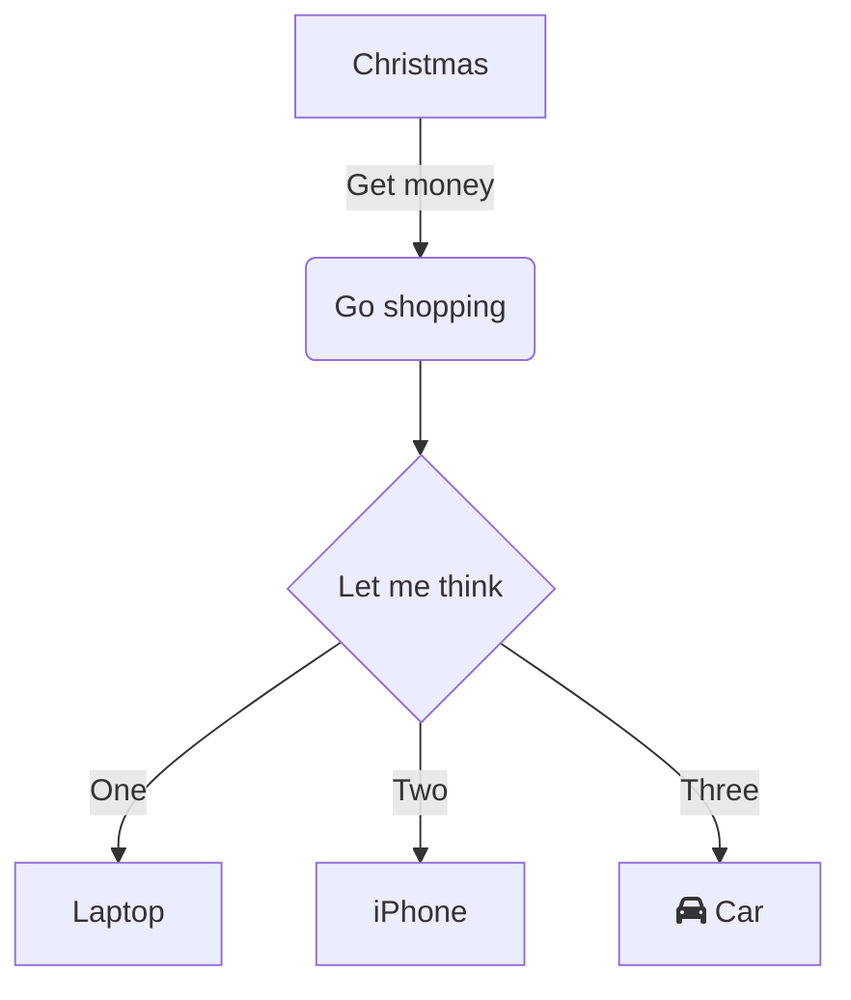

# pg-test-repo

```mermaid
graph TD
idPolicy(csi-policy)-->|xml|idCia(cia)

class idCia teal;

classDef default fill:#ffd000, stroke:#1a1446, stroke-width:2px;
classDef blue fill:#1a1446, stroke:#1a1446, stroke-width:2px;
classDef teal fill:#78e1e1, stroke:#1a1446, stroke-width:2px;
classDef darkteal fill:#06748c, stroke:#1a1446, stroke-width:2px;
classDef gray fill:#f5f5f5, stroke:#1a1446, stroke-width:2px;
```

```mermaid
graph TD
    A[Christmas] -->|Get money| B(Go shopping)
    B --> C{Let me think}
    C -->|One| D[Laptop]
    C -->|Two| E[iPhone]
    C -->|Three| F[fa:fa-car Car]
    
```
